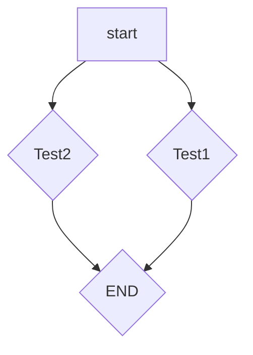

# Markdown の書き方(一部 HTML 使用)チートシート 🌟

## Table

| No  | 活動概要                                               | 実施・難易度     |
| --- | ------------------------------------------------------ | ---------------- |
| 1   | AIQ Tech Blog                                          | 🌟(星 1)         |
| 2   | 社内で、勉強会                                         | 🌟(星 1)         |
| 3   | 社外ハッカソンやコンペに Team で参加                   | 🌟🌟(星 2)       |
| 4   | プログラミング学習のサポートとなる教材の開発・研究活動 | 🌟🌟🌟(星 3)     |
| 5   | 社内ハッカソンやアイデアソンの開催                     | 🌟🌟🌟🌟(星 4)   |
| 6   | 社内の内製化システムの開発などの実践的な Team 開発     | 🌟🌟🌟🌟🌟(星 5) |
| 7   | エンジニア採用パイプラインを構築する                   | 🌟🌟🌟🌟🌟(星 5) |

## アコーディオン(折りたたみ)

<details>
<summary>ぷるぷるロボ玉</summary>
プルプルなのだ！
<br/>
ロボ玉なのだ！
<br/>
ハムなのだ！
</details>

## 引用

> これは引用です。
> ロボ玉は、プルプルハムスターです。
>
> > これは多重引用です。

## 見出しの表記: h タグ

マークダウンでは、#とスペースで、見出し(h タグ)を表現できる。

## h2 見出し

### h3 見出し

#### h4 見出し

##### h5 見出し

## リスト: ul & li タグ

- リストのアイテムは、\* もしくは、- を使って、指定する。
  - 親子関係は、インテンドで表現する。

### 我が家のペットたち List

- ハムたち
  - ロボ玉 Ver.3.0
  - まりたま

## 番号付きリスト: ol & li タグ

次のようにして、ol & li タグのマークダウン表現ができます。

1. 白桃さん

2. 桃ちゃん

## Link: a タグ

[表示文字](URL)でリンクに変換されます。

## 画像: img タグ

先頭に、 **!** で画像のと認識されます。  
画像の大きさなどの指定をする場合は img タグを使用します。

<!--
 -->

## Block 段落

空白行を挟むことで段落となります。

段落なし
<br>
段落なし

段落あり

段落あり

## 改行

AIQ
<br>
Tech

## 水平線: hr タグ

アンダースコア(\_), アスタリスク(\*)、ハイフン(-)などを 3 つ以上連続して記述します。

<hr>

---

---

---

## 強調表現: em & strong タグ

1.  em タグ(emphasis: 強調)

em 表現をしたい文字列の **「前後にスペース」** と、  
アスタリスク `*` もしくは、アンダースコア `_` **1** 個でを文字列を囲みます。  
<br/>
これは _イタリック Text_ なのです！  
<br/>

2.  strong

strong 表現をしたい文字列の **「前後にスペース」** と、  
 アスタリスク `*` もしくは、アンダースコア `_` **2** 個でを文字列を囲みます。  
 <br/>
これは **Strong_Text(太字)** なのです！  
 <br/>

3.  em + strong

em & strong 表現をしたい文字列の **「前後にスペース」** と、  
 アスタリスク `*` もしくは、アンダースコア `_` **3** 個でを文字列を囲みます。  
 <br/>
これは **_イタリック & Strong_Text(太字)_** なのです！  
 <br/>

## 打ち消し線

打ち消し線を使うには、`~~`で囲みます。  
~~打ち消し中な Text~~

---

## Code 表現

1. Block_Code  
   `バッククオート` 3 つ、あるいはダッシュ~３つで囲むことで、Code 埋め込みを表現できます。

```bash
echo 'ロボ玉'
```

```js
/**
 * NOTE: 2つの数値の間の乱数を返す関数
 * @name makeRundom - 乱数生成
 * @params {number} min - 最小値
 * @params {number} max - 最大値
 * @return {number} 乱数
 */
function makeRundom(min, max) {
  return Math.floor(Math.random() * (max - min + 1)) + min;
}
```

<br/>

2. インライン Code

`バッククオート` で単語を囲むとインラインコードになります。  
カレントのファイル・ディレクトリの一覧をすべて確認するには、`ls -al`を使います。

---


